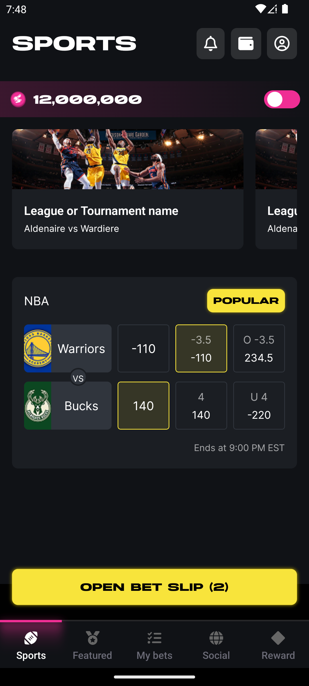
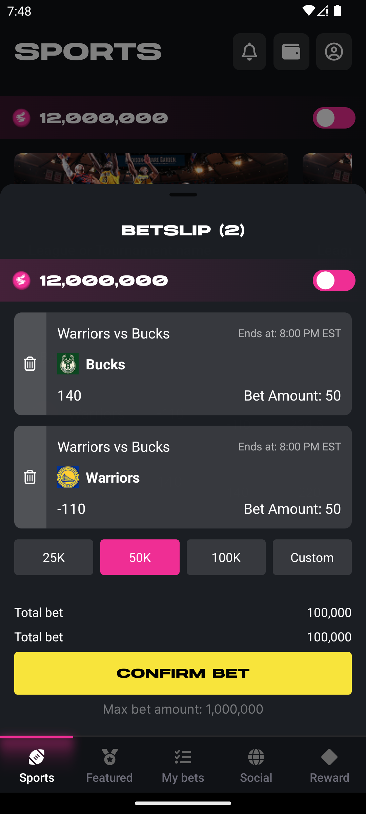

# 🏆 Sports Betting Platform

This repository contains both the **backend** (Express + GraphQL + Nexus + PostgreSQL) and the **frontend** (React Native + Relay) for a sports betting platform.

---

## 🚀 Project Overview
The platform allows users to **place bets on sports matches** while fetching real-time **odds and match data**.

- **Backend:** GraphQL API with Nexus, Express, and PostgreSQL.
- **Frontend:** React Native with Relay for efficient GraphQL data fetching.

---

# 🏗 Backend - Express + GraphQL + PostgreSQL

## 📌 Tech Stack
- **Express.js** - Lightweight Node.js framework for API development.
- **GraphQL (Nexus)** - Strongly-typed API for structured data fetching.
- **PostgreSQL** - SQL-based relational database for structured betting data.
- **Sequelize** - ORM for managing PostgreSQL migrations and queries.
- **Terraform + AWS (ECS, RDS)** - Infrastructure as Code (IaC) for scalable cloud deployment.

## 📌 Backend Setup

### 1️⃣ Clone Repository
```sh
git clone https://github.com/yourrepo/sports-betting.git
cd sports-betting/backend
```

### 2️⃣ Install Dependencies
```sh
npm install
```

### 3️⃣ Setup Environment Variables
Create a `.env` file in the `backend/` directory:
```sh
PORT=4000
DB_HOST=your_postgres_host
DB_USER=your_db_user
DB_PASS=your_db_password
DB_NAME=betting_db
```

### 4️⃣ Run Migrations and Seeders
```sh
npx sequelize-cli db:migrate
npx sequelize-cli db:seed:all
```

### 5️⃣ Start the Server
```sh
npm run server
```

The GraphQL API will be available at:
**`http://localhost:4000/graphql`**

## 📌 Backend Architecture

### 🛠 Database Schema
- **Teams** (`id`, `name`, `image`)
- **Matches** (`id`, `teamAId`, `teamBId`, `date`)
- **Odds** (`id`, `matchId`, `teamId`, `moneyline`, `spread`, `total`)
- **Bets** (`id`, `userId`, `matchId`, `teamId`, `betType`, `wagerAmount`, `odds`)

### 🛠 GraphQL API Endpoints
| Query | Description |
|--------|------------|
| `getMatches` | Fetch all matches |
| `placeBet` | Place a new bet |

## 📌 Why Express + GraphQL + PostgreSQL?

### ✅ Data Structure & Relationships
- Relational data (Matches, Teams, Bets) is best stored in **PostgreSQL**.
- **GraphQL's structured queries** enable flexible and optimized data fetching.

### ✅ Read/Write Access Patterns
- **Frequent Reads**: Matches, Odds (optimized with Relay).
- **Frequent Writes**: Bets, which need ACID transactions to maintain data consistency.

---

# 📱 Frontend - React Native + GraphQL + Relay

## 📌 Tech Stack
- **React Native** - Cross-platform mobile framework for iOS and Android.
- **GraphQL + Relay** - Efficient data fetching and real-time updates.
- **TanStack React Query (for polling)** - Ensures fresh match & odds data.

## 📌 Frontend Setup

### 1️⃣ Clone Repository
```sh
git clone https://github.com/yourrepo/sports-betting.git
cd sports-betting/frontend
```

### 2️⃣ Install Dependencies
```sh
npm install --force
```

### 3️⃣ Start Development Server
```sh
npx expo start
```
### 🏠 Home Screen
Displays the list of available matches with odds.




### 🏆 Bet Screen
Allows users to place bets on selected matches.



## 📌 Why React Native + Relay?

### ✅ Data Structure & Scalability
- **GraphQL ensures structured & optimized queries**, preventing over-fetching.
- **Relay uses fragments & caching** to reduce re-fetching overhead.

### ✅ Real-time Betting Experience
- **Polling via React Query** ensures updated match/odds data every few seconds.
- **Optimistic UI Updates** ensure instant response when placing bets.

---

# ☁️ Deployment Infrastructure (IaC - Terraform) - It's not done!!!

## 📌 Deployment Stack
- **AWS ECS Fargate** - Runs the GraphQL API in a containerized environment.
- **AWS RDS (PostgreSQL)** - Managed relational database for bets & matches.
- **AWS Security Groups** - Ensures safe DB access.
- **Terraform** - Defines infrastructure as code for easy deployment.

## 📌 Why AWS ECS + PostgreSQL?
- **Scalability** - ECS Fargate scales on demand.
- **Reliability** - AWS RDS manages DB backups & security.
- **Security** - Defined IAM roles & security groups ensure controlled access.

---

# 🎯 Conclusion
This project is optimized for **performance, scalability, and maintainability** using modern technologies. By leveraging **GraphQL, Relay, PostgreSQL, and AWS infrastructure**, we ensure a **fast, scalable sports betting platform**.

🚀 **Happy Betting!**

